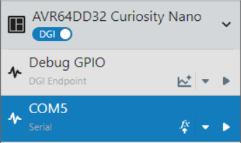
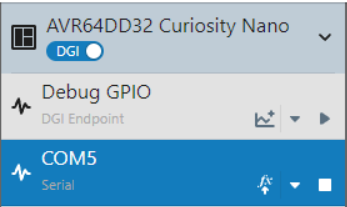

<!-- Please do not change this logo with link -->

# Lightweight USART Driver for AVR64DD32

This example creates a lightweight USART (Universal Serial Asynchronous Receiver Transmitter) peripheral API for the AVR&reg; DD family of microcontrollers (MCUs). The USART API includes an (optional) ring buffer API for easy processing of received characters, as well as a simple test program to show transmit and receive.

## Related Documentation

- [Window Security Sensor with an AVR® DB Microcontroller, MLX90632 and MLX90392](https://github.com/microchip-pic-avr-examples/avr128db28-smart-security-sensor-mplab)
  - USART API was developed as part of this project. This program also shows more complex use of the ring buffer for parsing Bluetooth messages.

## Software Used

- [MPLAB® X IDE 6.0.0 or newer](#)
- [MPLAB® XC8 2.40.0 or newer compiler](#)
- [MPLAB Data Visualizer](#) or other serial terminal

## Hardware Used

- [AVR64DD32 Curiosity Nano Evaluation Kit (???)](#)

## Setup

### UART Settings
- Baud: 115,200  
- Char Length: 8 bits  
- Parity: None  
- Stop Bits: 1 bit

### I/O Usage

| Pin | Function
| --- | --------
| PC0 | USART Transmit
| PC1 | USART Receive
| PF5 | Built-in LED (active LOW)

## Setting up Data Visualizer

1. Press the Data Visualizer Icon in the MPLAB X toolbar

2. Select the COM port of the Curiosity Nano, but do not connect to it. (COM port may vary)  

3. Change the UART Settings to the following:
  - Baud: 115,200  
  - Char Length: 8 bits  
  - Parity: None  
  - Stop Bits: 1 bit  

  
4. Connect to the COM Port

  

5. Assign the COM port to the serial terminal

6. If the device is already programmed, no text will display. The command "HELP" can be used to show the instructions again. (If not programmed at this point, program the device.)

## Operation

The included program shows an example of how to handle transmit and receive for USART traffic. On startup, the USART peripheral is initialized, and transmit and receive are enabled. A set of instructions for the user are printed to the screen, then the program waits for user input. The user can type the following commands followed by ENTER:

- LED ON
- LED OFF
- LED TOGGLE

Note: **These commands are space- and case-sensitive!**

Accordingly, the command entered will change the state of the LED appropriately.

### Parsing the Input

Note: This section discusses how user input is parsed, and is not required for operating this example.

First, when the COM port sends a character, it will become loaded into the receive buffer of the USART peripheral and generate an interrupt. This interrupt handler will call a function callback to the function `void loadCharacterToBuffer(char c)` in `main.c`. This function is required, because the ring buffer API uses 2 parameters, not 1, to support multiple ring buffers with the same file.

The implemented function simply loads the character from the USART interrupt handler into the ring buffer. This function would be a good place to add input validation (ie: is it legal to receive non-printing characters) and to capitalize the input characters to remove case-sensitivity, if desired.

Back in main, the program continuously searches the ring buffer for ENTER, which is assumed to be the character sequence `\r\n` (some devices may use a different sequence). When this sequence is detected, the ring buffer attempts to match the text of each command string. If the text matches, then the command is executed. If no text matches, an error message is printed. At the end of this sequence, the ring buffer is advanced to the character following the `\r\n`, since the text prior has been processed and executed already.  

Note: **This assumes only 1 command is in the buffer at a time. If you were to enter the following sequence `LED ON\r\nLED OFF\r\n` before the program could process the first command, the first command may not execute, and the 2nd command may execute twice, depending on the search order.**

## API Reference

### USART API
Note: This API only supports USART in polling mode for TX and interrupt mode for RX.

| Function Name | Description
| ------------- | ----------
| void USART0_init(void) | Initializes the USART peripheral, but NOT the I/O required.
| void USART0_initIO(void) | Initializes the I/O for the USART peripheral.
| void USART0_enableTX(void) | Enables the USART peripheral's transmitter.
| void USART0_disableTX(void) | Disables the USART peripheral's transmitter.
| void USART0_enableRX(void) | Enables the USART peripheral's receiver.
| void USART0_disableRX(void) | Disables the USART peripheral's receiver.
| void USART0_setRXCallback(void (*function)(char)) | Sets the callback function to handle any received characters. If this is not set, the program will discard any characters received.
| bool USART0_sendByte(char c) | Sends a single byte on the USART transmitter. To send a string, see the function `USART_sendString` in USART Utilities. Returns true if a byte was loaded into the transmitter, and false if the transmitter was full.
| bool USART0_canTransmit(void) | Returns true if the transmitter can accept data to send.
| bool USART0_isBusy(void) | Returns true if the transmit shifter is running.
| bool USART0_isRXActive(void) | Returns true if the receive shifter is running.

### USART Utilities
Note: The USART destination functions are defined in the header. Using another USART or a different API may require changes.

| Function Name | Description
| ------------- | ----------
| void USART_sendString(const char* str) | Sends a string to the configured USART peripheral.

### Ring Buffer API

#### Data Types

| Data Type | Description
| --------- | -----------
| RingBufferSize | This data type is the size of the index pointers in the ring buffer. By default, these are uint8_t values, but if large (>255) buffers are needed, this can be changed appropriately at the cost of code size and speed.
| RingBuffer | This data type defines the current ring buffer. The type contains a pointer to the allocated pool of memory, the read / write indexes, and the size of the memory pool. It is recommended not to modify or set values in here, as the API functions require it to be valid at all times, with the exception of `ringBuffer_createBuffer`.

#### Functions

| Function Name | Description
| ------------- | ----------
| void ringBuffer_createBuffer(RingBuffer* buffer, char* memPtr, RingBufferSize size) | This function initializes the ring buffer with the specified with the memory pool and size. The buffer becomes valid after this function.
| void ringBuffer_softCopy(RingBuffer* src, RingBuffer* dst) | This function duplicates the pointers from src to dst, but DOES NOT copy the values in the buffer. The intended use of this function is to parse a string or other complex object without copying memory.
| void ringBuffer_duplicate(RingBuffer* src, RingBuffer* dst) | This function copies data from src to dst. All unread values are copied, as well as the read/write indexes. If destination can't store all of the data from source, it will be cut off, but will not overflow.
| void ringBuffer_reset(RingBuffer* buffer) | This function fills the ring buffer memory with `\0` and resets the read and write indexes to 0. A similar function that executes much faster is `ringBuffer_flushReadBuffer`.
| bool ringBuffer_isEmpty(RingBuffer* buffer) | This function returns true if no data is present in the buffer.
| void ringBuffer_incrementReadIndex(RingBuffer* buffer) | This function advances the read index pointer 1 position.
| void ringBuffer_advanceReadIndex(RingBuffer* buffer, RingBufferSize len) | This function advances the read index pointer `len` positions up. If a known string has the first `len` characters being discarded, this function can be used to skip them.
| bool ringBuffer_advanceToString(RingBuffer* buffer, const char* str) | This function advances the read index to the character immediately following the specified string. Returns true if the string is found.
| bool ringBuffer_find(RingBuffer* buffer, const char* str) | This function searches the ring buffer for the specified string `str`. If the string is found, then the function returns true.
| RingBufferSize ringBuffer_count(RingBuffer* buffer, char search) | This function returns the number of characters that match the character `search`.
| RingBufferSize ringBuffer_charsToRead(RingBuffer* buffer) | This function returns the total number of characters available to read in the ring buffer.
| void ringBuffer_flushReadBuffer(RingBuffer* buffer) | This function resets the ring buffer by setting the read index to the write index, however memory is unchanged. In most cases, this function is preferred over `ringBuffer_reset` since it does not reinitialize the array.
| void ringBuffer_incrementWriteIndex(RingBuffer* buffer) | This function increments the write index by 1. This function is only called internally. **DO NOT CALL**
| bool ringBuffer_loadCharacter(RingBuffer* buffer, char input) | This function loads an input character into the ring buffer.
| bool ringBuffer_loadCharacters(RingBuffer* buffer, const char* input, RingBufferSize len) | This function loads `len` characters into the ring buffer. This function does not require the input to be NULL-terminated.
| bool ringBuffer_loadString(RingBuffer* buffer, const char* input) | This function copies a NULL-terminated string into the ring buffer.
| char ringBuffer_getChar(RingBuffer* buffer) | This function returns the current character to read in the ring buffer and increments the read index. If no character is available, then `\0` is returned.
| char ringBuffer_peekChar(RingBuffer* buffer) | This function returns the current character to read in the ring buffer and does NOT increment the read index. If no character is available, then `\0` is returned.
| RingBufferSize ringBuffer_copyBuffer(RingBuffer* buffer, char* dest, RingBufferSize len) | This function copies up-to `len` bytes of data from the ring buffer to a destination string, starting at the current read index. `\0` will be appended to the destination string. Read index is not modified by this operation. Returns the number of bytes copied.
| RingBufferSize ringBuffer_copyRawBuffer(RingBuffer* buffer, char* dest, RingBufferSize len) | This function copies up-to `len` bytes of data from the ring buffer to a destination string, starting at the current read index. NO `\0` will be appended to the destination string. Read index is not modified by this operation. Returns the number of bytes copied.
| RingBufferSize ringBuffer_copyBufferUntil(RingBuffer* buffer, char* dest, char delim, RingBufferSize len) | This function copies up-to `len` bytes of data from the ring buffer to a destination string, starting at the current read index and stopping at the deliminator `delim`, if found. `\0` will be appended to the destination string. Read index is not modified by this operation. Returns the number of bytes copied.
| RingBufferSize ringBuffer_copyAndChop(RingBuffer* buffer, char* dest, char start, char stop, RingBufferSize len) | This function copies up-to `len` bytes of data from the ring buffer to a destination string, starting at the first instance of start `start` and stopping at the deliminator `stop`, if found. (Beginnning index is read index). `\0` will be appended to the destination string. Read index is not modified by this operation. Returns the number of bytes copied. (If start is not found, 1 byte (`\0`) is copied.)

### Memory Allocation

To use this API, the user must allocate a pool of memory for the ring buffer. Usually, this looks like `char myMemory[MY_BUFFER_SIZE]`. This memory must always remain valid while the buffer is in use. After allocating the memory pool, call `void ringBuffer_createBuffer` to initialize the `RingBuffer` data type.

## Summary
This example has shown a lightweight USART driver on the AVR64DD32 microcontroller.
